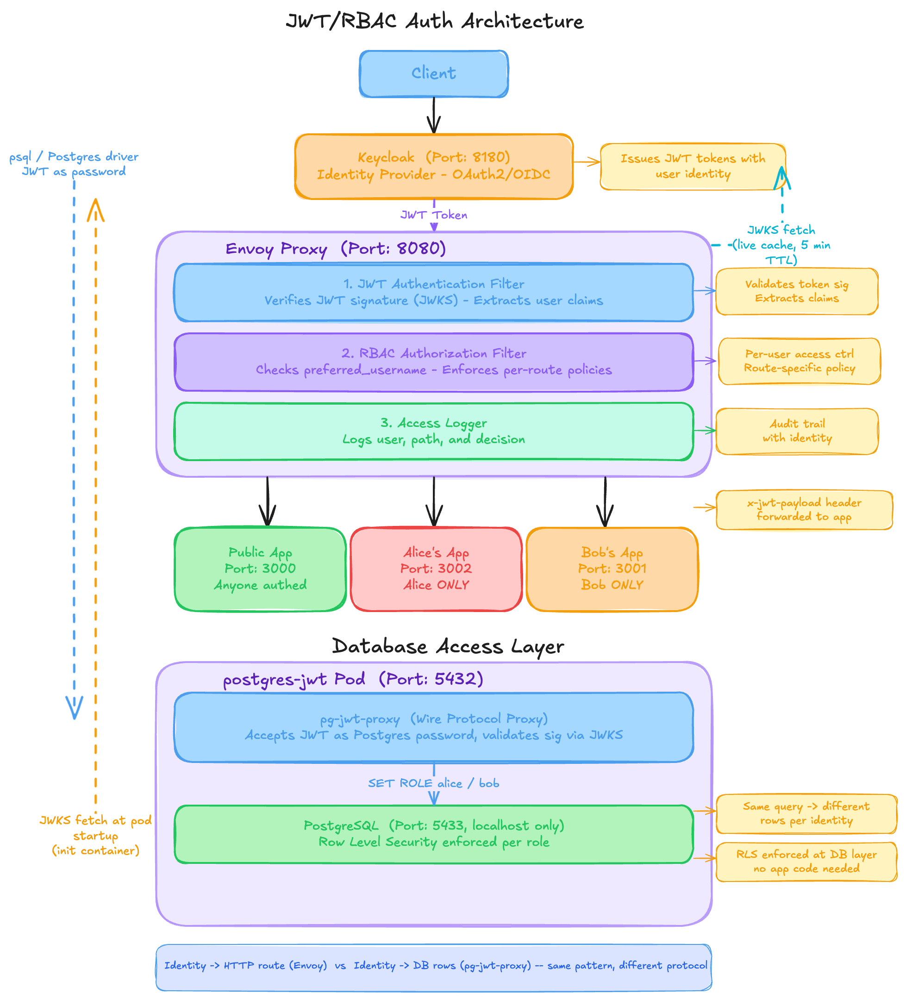

# Identity-Aware Access Control with Reverse Proxies

A hands-on workshop demonstrating how reverse proxies enforce identity-based access control using JWT tokens — without modifying application code.

---

## Architecture



Envoy enforces identity at the HTTP layer; the Postgres proxy enforces it at the wire-protocol layer. Both trust the same JWT issued by Keycloak — no shared state between them.

---

## Workshop Agenda

| Part | Topic | Duration |
|------|-------|----------|
| 1 | The Problem with Network-Level Trust | 10 min |
| 2 | Identity Foundations with OAuth2/OIDC | 20 min |
| 3 | Building the Reverse Proxy Security Layer | 25 min |
| 4 | Testing Identity Restrictions | 15 min |
| 5 | Audit Logging and Production Considerations | 15 min |
| — | Extension: Identity-Aware Postgres | beyond 90 min |

---

## Prerequisites

- `kubectl`
- `helm` v3
- `docker`
- `curl`, `jq`, `psql`
- A running Kubernetes cluster — see cluster setup below

### Cluster setup

**kind (recommended — works entirely offline, no external registry needed):**
```bash
kind create cluster --name workshop
```

**Docker Desktop:** Enable Kubernetes in Docker Desktop preferences. No extra setup needed.

**EKS or other cloud cluster:** Any standard cluster works. For the Envoy service you will need a LoadBalancer or ingress instead of the NodePort option described below.

---

## Repository Structure

```
.
├── apps/
│   ├── public-app/       # Node.js: responds to any authenticated user
│   ├── alice-app/        # Node.js: alice's private service (port 3002)
│   └── bob-app/          # Node.js: bob's private service (port 3001)
├── docs/
│   ├── architecture.excalidraw  # editable diagram source
│   └── architecture.png         # exported for README and slides
├── postgres-proxy/       # Go wire-protocol JWT proxy
│   ├── main.go
│   ├── go.mod
│   └── Dockerfile
└── helm/
    ├── keycloak/         # Plain k8s manifest — Keycloak + demo realm
    ├── public-app/       # Helm chart
    ├── alice-app/        # Helm chart
    ├── bob-app/          # Helm chart
    ├── envoy/            # Helm chart — JWT authn + RBAC gateway
    └── postgres/         # Helm chart — Postgres with JWT proxy sidecar
```

---

## Lab Setup

### Step 1: Images

Pre-built images are published to `ghcr.io/tenaciousdlg/` on every commit to `main` and are set as defaults in each chart — no build step required for most attendees.

**To use pre-built images (recommended):** skip this step entirely and proceed to Step 2.

**To build your own** (if you've modified the app source):
```bash
# kind — load directly, no registry needed
docker build -t public-app:latest   ./apps/public-app
docker build -t alice-app:latest    ./apps/alice-app
docker build -t bob-app:latest      ./apps/bob-app
docker build -t pg-jwt-proxy:latest ./postgres-proxy

kind load docker-image public-app:latest   --name workshop
kind load docker-image alice-app:latest    --name workshop
kind load docker-image bob-app:latest      --name workshop
kind load docker-image pg-jwt-proxy:latest --name workshop

# Then override the image on install:
# helm install public-app helm/public-app --set image.repository=public-app --set image.pullPolicy=Never
```

### Step 2: Deploy Keycloak

```bash
kubectl apply -f helm/keycloak/keycloak.yaml
kubectl wait deployment/keycloak --for=condition=Available --timeout=120s
```

Keycloak is pre-configured with:
- Realm: `demo`
- Users: `alice` (password: `password`), `bob` (password: `password`, roles: `user`, `admin`)
- Client: `demo-client` (public, direct grants enabled)

### Step 3: Deploy the backend apps

```bash
helm install public-app helm/public-app
helm install alice-app  helm/alice-app
helm install bob-app    helm/bob-app
```

### Step 4: Deploy Envoy

```bash
# kind / Docker Desktop — expose via NodePort so curl can reach it from your laptop
helm install envoy helm/envoy --set nodePort.enabled=true

# EKS / cloud — use ClusterIP and port-forward instead
helm install envoy helm/envoy
kubectl port-forward svc/envoy 8080:8080 &
```

---

## Lab Exercises

These map to the workshop agenda. Complete Steps 1–4 above before starting.

---

### Part 2: Decode a JWT (OAuth2/OIDC hands-on)

Port-forward Keycloak so you can reach it from your laptop:
```bash
kubectl port-forward svc/keycloak 8180:8180 &
```

Authenticate as alice and inspect the token:
```bash
ALICE_TOKEN=$(curl -s http://localhost:8180/realms/demo/protocol/openid-connect/token \
  -d "client_id=demo-client&grant_type=password&username=alice&password=password" \
  | jq -r .access_token)

# Decode the payload — no signature verification, just base64
echo $ALICE_TOKEN | cut -d. -f2 | base64 -d 2>/dev/null | jq .
```

Key claims to find:
- `preferred_username` — this is what Envoy's RBAC filter reads
- `realm_access.roles` — bob has `admin` here; notice it doesn't grant extra HTTP access
- `exp` — token expiry (Unix timestamp, default 900s)

Do the same for bob:
```bash
BOB_TOKEN=$(curl -s http://localhost:8180/realms/demo/protocol/openid-connect/token \
  -d "client_id=demo-client&grant_type=password&username=bob&password=password" \
  | jq -r .access_token)

echo $BOB_TOKEN | cut -d. -f2 | base64 -d 2>/dev/null | jq .
```

---

### Part 3: Configure per-user access control (Envoy)

The Envoy configuration lives in [helm/envoy/templates/configmap.yaml](helm/envoy/templates/configmap.yaml). The key section is the RBAC filter — open it and find the `allow-alice-only` policy:

```yaml
principals:
- metadata:
    filter: "envoy.filters.http.jwt_authn"
    path:
    - key: "jwt_payload"
    - key: "preferred_username"
    value:
      string_match:
        exact: "alice"
```

This is how `preferred_username` from the decoded JWT becomes a routing decision. The `jwt_payload` key is populated by the JWT authn filter that runs before RBAC — the filters are a pipeline.

To see your Envoy config rendered:
```bash
helm template envoy helm/envoy | grep -A 60 "envoy.yaml"
```

---

### Part 4: Test identity restrictions

With tokens from Part 2 still in `$ALICE_TOKEN` and `$BOB_TOKEN`:

```bash
# Unauthenticated — rejected before reaching any app
curl -i http://localhost:8080/public                           # 401

# Authenticated — both users can reach /public
curl -s -H "Authorization: Bearer $ALICE_TOKEN" http://localhost:8080/public | jq .
curl -s -H "Authorization: Bearer $BOB_TOKEN"   http://localhost:8080/public | jq .

# Alice reaches /alice; bob is forbidden (403)
curl -i -H "Authorization: Bearer $ALICE_TOKEN" http://localhost:8080/alice  # 200
curl -i -H "Authorization: Bearer $BOB_TOKEN"   http://localhost:8080/alice  # 403

# Bob reaches /bob; alice is forbidden (403)
curl -i -H "Authorization: Bearer $BOB_TOKEN"   http://localhost:8080/bob    # 200
curl -i -H "Authorization: Bearer $ALICE_TOKEN" http://localhost:8080/bob    # 403
```

**Discussion point — why doesn't bob's `admin` role help?**

Bob has `realm_access.roles: ["user", "admin"]` in his JWT. The Envoy RBAC policy for `/alice` only checks `preferred_username == "alice"`. Roles are not evaluated for that path. This is intentional: identity (who you are) is enforced independently of roles (what class of user you are). An admin role might grant access to an admin panel; it does not override per-user data isolation. Both are claims in the same JWT — the policy decides which claim matters for each resource.

---

### Part 5: Read the audit log

```bash
# Tail Envoy's access log — structured JSON per request
kubectl logs -l app.kubernetes.io/name=envoy -f | jq '{user,path,status,response_flags}'
```

Each line includes the `preferred_username` extracted from the JWT — requests are attributed to an identity, not just an IP. A 403 shows `response_flags: "RBAC_ACCESS_DENIED"`.

---

## Extension: Identity-Aware Postgres

> This goes beyond the 90-minute workshop agenda. It demonstrates the same identity pattern applied to the Postgres wire protocol instead of HTTP.

The Postgres chart deploys a sidecar proxy that accepts standard `psql` connections. Clients present their JWT as the password — the proxy validates it, calls `SET ROLE <username>`, and Postgres Row Level Security enforces per-identity data isolation. No application code changes required.

### Deploy

```bash
helm install db helm/postgres
```

### Test

```bash
kubectl port-forward svc/db-postgres-jwt 5432:5432 &

# Alice sees only her rows
PGPASSWORD=$ALICE_TOKEN psql -h localhost -U alice -d app -c "SELECT * FROM api.user_data;"

# Bob sees only his rows
PGPASSWORD=$BOB_TOKEN psql -h localhost -U bob -d app -c "SELECT * FROM api.user_data;"

# Invalid token — connection rejected at the proxy, never reaches Postgres
PGPASSWORD="not-a-jwt" psql -h localhost -U alice -d app -c "SELECT 1;"
```

Same query. Same table. Identity is the only variable.

The RLS policies (see [helm/postgres/templates/configmap-init-sql.yaml](helm/postgres/templates/configmap-init-sql.yaml)):
```sql
CREATE POLICY alice_isolation ON api.user_data
  FOR ALL TO alice
  USING  (owner = 'alice')
  WITH CHECK (owner = 'alice');
```

### How it compares to Envoy

| | Envoy | pg-jwt-proxy |
|---|---|---|
| Protocol | HTTP/1.1, HTTP/2 | Postgres wire protocol |
| Identity source | `Authorization: Bearer` header | Password field in startup handshake |
| Enforcement | RBAC filter → route decision | `SET ROLE` → RLS policy |
| App changes needed | None | None |

The pattern is identical: intercept the connection, validate the JWT, enforce identity before the request reaches the resource.

---

## Configuration Reference

### Envoy chart (`helm/envoy/values.yaml`)

| Key | Default | Description |
|-----|---------|-------------|
| `keycloak.url` | `http://keycloak:8180` | Base URL — must match JWT `iss` claim |
| `keycloak.realm` | `demo` | Keycloak realm name |
| `keycloak.host` | `keycloak` | Cluster DNS name for JWKS upstream |
| `keycloak.port` | `8180` | Keycloak service port |
| `nodePort.enabled` | `false` | Set `true` for kind/Docker Desktop |
| `nodePort.port` | `30080` | NodePort value (30000–32767) |

### Postgres chart (`helm/postgres/values.yaml`)

| Key | Default | Description |
|-----|---------|-------------|
| `image.proxy.repository` | `""` | **Required**: image built from `postgres-proxy/` |
| `keycloak.url` | `http://keycloak:8180` | Used by init container to fetch JWKS |
| `keycloak.issuer` | `""` | Optional `iss` claim validation |
| `proxy.roleClaim` | `preferred_username` | JWT claim mapped to Postgres role |
| `postgres.port` | `5433` | Internal Postgres port (proxy owns 5432) |

---

## Automated Testing

### Smoke test (local)

After completing Lab Setup, verify everything is working in one command:

```bash
# Sets up port-forwards, runs all assertions, cleans up
PORT_FORWARD=true bash scripts/smoke-test.sh
```

Or if you already have port-forwards running:
```bash
bash scripts/smoke-test.sh
```

The script tests JWT authentication (401 without token), RBAC enforcement (200/403 per identity and path), and that the app receives the forwarded JWT payload. It prints a pass/fail line per assertion and exits non-zero on any failure.

### CI (GitHub Actions)

Every push and pull request runs two jobs automatically:

| Job | What it checks |
|-----|----------------|
| `lint` | `helm lint` all charts + `go build` + `go vet` on the proxy |
| `e2e` | Spins up a kind cluster, deploys the full stack, runs the smoke test |

---

## Troubleshooting

**Envoy returns 401 for all requests:**
Keycloak may not be ready or the JWKS endpoint is unreachable from inside the cluster. Verify:
```bash
kubectl run -it --rm curl --image=curlimages/curl --restart=Never -- \
  curl -s http://keycloak:8180/realms/demo/protocol/openid-connect/certs | jq .
```

**Token fetch fails with "connection refused":**
The Keycloak port-forward is not running. Run: `kubectl port-forward svc/keycloak 8180:8180 &`

**Postgres proxy logs "JWKS fetch failed":**
The init container couldn't reach Keycloak during pod startup. Check Keycloak pod status: `kubectl get pods`

**`psql` gets "FATAL: authentication failed":**
Token is likely expired (default: 900s). Re-fetch using the curl command in Part 2.

**Init scripts didn't run ("Skipping initialization"):**
The PVC has data from a previous run. Reset:
```bash
kubectl scale deployment/db-postgres-jwt --replicas=0
kubectl delete pvc db-postgres-jwt-data
helm upgrade db helm/postgres --set image.proxy.repository=...
```
